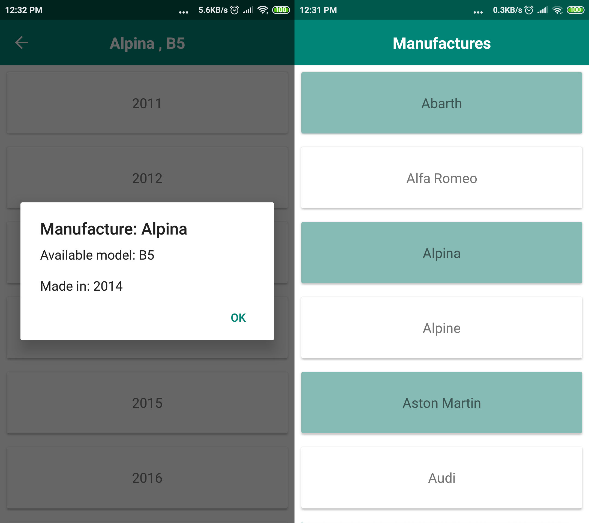
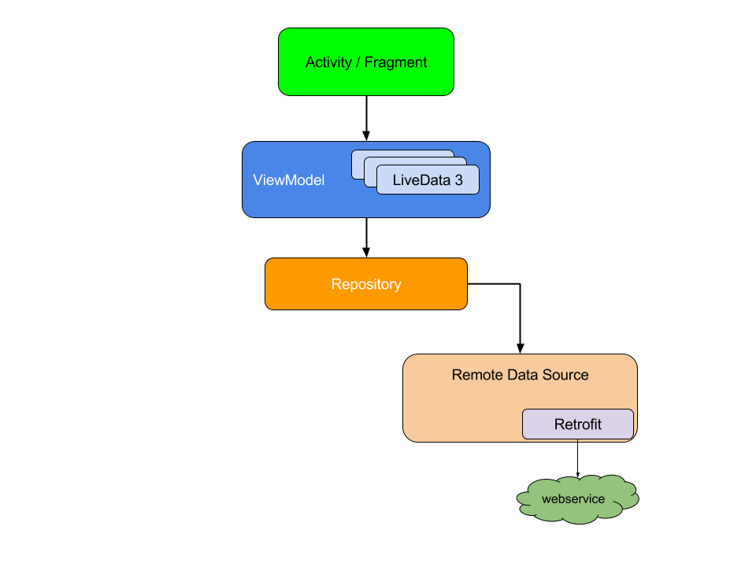

# CarShow

This repository contains a detailed sample app that implements MVVM architecture using Dagger2, Room, RxJava2, Paging and lifecycle for
get car info from http://api-aws-eu-qa-1.auto1-test.com

# Demo
 <pre>
    
</pre>

  

# Libraries Used

<dl>
  <dt>Patterns and frameworks</dt>
  <dd>- MVVM (Model-View-ViewModel) using Google's new Architecture components ViewModel, LiveData, LifecycleObserver, etc.</dd>
  <dd>- Recommended app architecture in https://developer.android.com/jetpack/docs/guide</dd>
  
  <dt>Remote Call APIs</dt>
  <dd>- Retrofit 2 to perform HTTP requests.</dd>
  
  <dt>Dependency Injection</dt>
  <dd>- Dagger Android 2.22.1 to manage App and Activity-scoped dependencies. </dd>
    
  <dt>Communication between app layer</dt>
  <dd>- RxJava2 and RxAndroid for interacting between ViewModel and rest calls. </dd>
  <dd>- livedData for interacting between view and ViewModel and repositories.  </dd>
    
  <dt>other</dt>
  <dd>- AndroidX (1.0.0) </dd>
</dl>

# Features 
- screen rotation is handled
- using ViewModel class, restore fragment data in navigation
- list has paging feature and different view for even and odd tiles.

# Developed By
Hossein Gheisary - hosseingheisary1365@gmail.com   

# The app has following modules:
1.	data: It contains all the data accessing and manipulating components.
2.  presentation: View classes along with their corresponding ViewModel. Dependency providing classes using Dagger2 and Utility classes

## Overview
     consider the following diagram, which shows how all the  modules  interact with one 
     
     another after designing the app:
     
     

## Some consideration
#### google paging library has a issue with dagger : 
After call mDataSource.invalidate() method, mDataSource will be invalidated and the new DataSource instance will be created via DataSource.Factory.create() method, so its important to provide new DataSource() instance every time inside DataSource.Factory.create() method.So I did not inject ItemKeyedDataSource inside DataSource.Factory.

